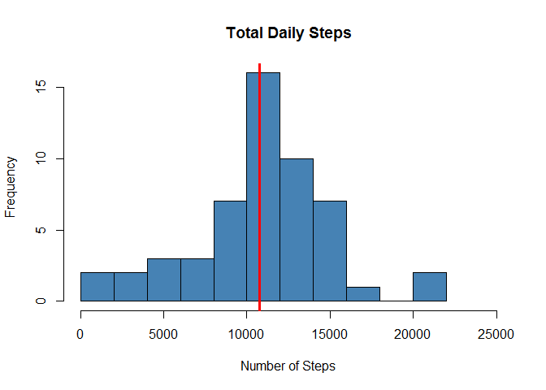
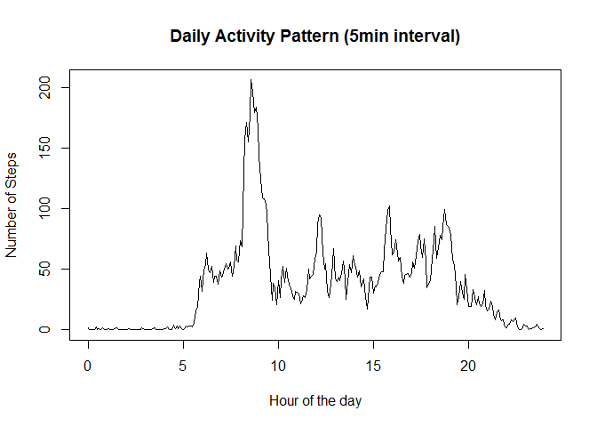
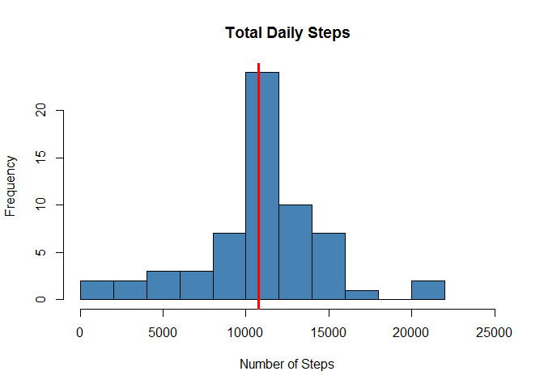
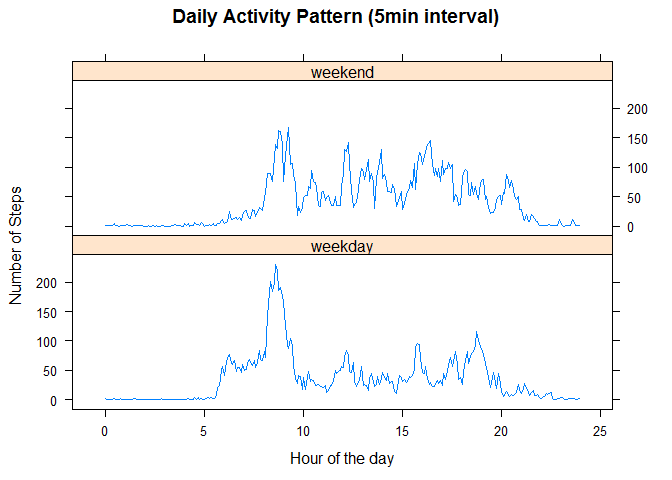

# Reproducible Research: Peer Assessment 1


## Loading and preprocessing the data

Let's load the Activity Monitoring Device (AMD) dataset and have a look at it :


```r
# NOTE: We assume the data is unzipped in the same location as the Rmd file.
AMDdata <- read.csv("activity.csv", stringsAsFactors = FALSE, na.strings = "NA")
str(AMDdata)
```

```
## 'data.frame':	17568 obs. of  3 variables:
##  $ steps   : int  NA NA NA NA NA NA NA NA NA NA ...
##  $ date    : chr  "2012-10-01" "2012-10-01" "2012-10-01" "2012-10-01" ...
##  $ interval: int  0 5 10 15 20 25 30 35 40 45 ...
```

```r
head(table(AMDdata$date))
```

```
## 
## 2012-10-01 2012-10-02 2012-10-03 2012-10-04 2012-10-05 2012-10-06 
##        288        288        288        288        288        288
```

```r
length(table(AMDdata$date))
```

```
## [1] 61
```

```r
head(table(AMDdata$interval))
```

```
## 
##  0  5 10 15 20 25 
## 61 61 61 61 61 61
```

```r
tail(table(AMDdata$interval))
```

```
## 
## 2330 2335 2340 2345 2350 2355 
##   61   61   61   61   61   61
```

The dataset  has 3 variables:  
- steps is an integer;  
- date is encoded in strings and will converted in date-time format;  
- interval is an integer. It' s actually the time when the 5-min interval starts, encoded as HHMM. We might have to convert to hours or minutes later on.  

The data spans 61 days, and 288 5-min intervals per day (so the whole 24 hours).


```r
library(lubridate)
AMDdata$date <- ymd(AMDdata$date)
```

## What is mean total number of steps taken per day?

Let's first calculate the total number of steps for each day, and then calculate the mean and median.
We will discard the observations having NAs.

```r
dailySteps <- aggregate(steps~date, AMDdata[complete.cases(AMDdata),], sum)
dailyStepsMean <- mean(dailySteps$steps)
dailyStepsMedian <- median(dailySteps$steps)
c(dailyStepsMean, dailyStepsMedian)
```

```
## [1] 10766.19 10765.00
```

Let's show the data with an histogram, and show the median with a red line:

```r
hist(dailySteps$steps, breaks=10, main="Total Daily Steps", 
     xlab="Number of Steps", xlim=c(0, 25000), col="steelblue")
abline(v=dailyStepsMedian, lwd=3, col="red")
```


  
It' s worth noting the 2 days above 20,000 steps.

## What is the average daily activity pattern?
We will compute the average number of steps for each interval, averaged accross the days. We will discard the observations with missing values, and convert the interval integer into hours to make more sense of it when we plot.

```r
ivalSteps <- aggregate(steps~interval, AMDdata[complete.cases(AMDdata),], mean)
ivalSteps$hours <- (ivalSteps$interval %/% 100) + (ivalSteps$interval %% 100)/60
with(ivalSteps, plot(x=hours, y=steps, type="l", main="Daily Activity Pattern (5min interval)", xlab="Hour of the day", ylab="Number of Steps"))
```



## Imputing missing values
First, let's check what is missing:

```r
sum(is.na(AMDdata$steps))
```

```
## [1] 2304
```

```r
sum(is.na(AMDdata$date))
```

```
## [1] 0
```

```r
sum(is.na(AMDdata$interval))
```

```
## [1] 0
```
We only need to fix the 2,304 NA values in steps. We will input the mean for the relevant 5-min interval. 

```r
missing <- is.na(AMDdata$steps) # boolean
# for each missing steps value 
#      => get the matching interval index in ivalSteps
idx  <- sapply(AMDdata[missing, ]$interval, 
               function(x) which(ivalSteps$interval == x))
# copy non-missing...
impData <- AMDdata
# ...and imputed data in impData
impData[missing,]$steps <- ivalSteps$steps[idx]
```

Let's have a look at the effect of imputing missing values on the mean and the median, comparing to the previous values:

```r
impDailySteps <- aggregate(steps~date, impData, sum)
impDailyStepsMean <- mean(impDailySteps$steps)
impDailyStepsMedian <- median(impDailySteps$steps)
c(impDailyStepsMean, impDailyStepsMedian)
```

```
## [1] 10766.19 10766.19
```

```r
c(dailyStepsMean, dailyStepsMedian)
```

```
## [1] 10766.19 10765.00
```
It looks like both the new mean and median have converged to the previous mean. Since the new and previous mean looks the same, we can hypothetize that whole days were missing, so adding "average days" didn't change anything. Let's prove this:

```r
table(AMDdata[is.na(AMDdata$steps),]$date)
```

```
## 
## 2012-10-01 2012-10-08 2012-11-01 2012-11-04 2012-11-09 2012-11-10 
##        288        288        288        288        288        288 
## 2012-11-14 2012-11-30 
##        288        288
```
8 full days were missing. As far as the median is concerned, since we added 8 average days slightly above the original median, it has moved up circa 4 observations with a high probability of landing on one the 8 added days.  
  
Now let's plot the histogram for the corrected data:

```r
hist(impDailySteps$steps, breaks=10, main="Total Daily Steps", 
     xlab="Number of Steps", xlim=c(0, 25000), col="steelblue")
abline(v=impDailyStepsMedian, lwd=3, col="red")
```


  
We can see that the central cell is much higher than without imputing missing data (8 more observations).

## Are there differences in activity patterns between weekdays and weekends?


```r
impData$weekday <- as.factor(sapply(wday(impData$date),
                                    function(x) { if (x==1|x==7) "weekend" else "weekday" } ))

ivalStepsW <- aggregate(steps~interval+weekday, impData, mean)
ivalStepsW$hours <- (ivalStepsW$interval %/% 100) + (ivalStepsW$interval %% 100)/60
library(lattice)
impData$weekday <- as.factor(sapply(wday(impData$date),
                                    function(x) { if (x==1|x==7) "weekend" else "weekday" } ))

ivalStepsW <- aggregate(steps~interval+weekday, impData, mean)
ivalStepsW$hours <- (ivalStepsW$interval %/% 100) + (ivalStepsW$interval %% 100)/60
library(lattice)
with(ivalStepsW, xyplot(steps~hours|weekday, type="l", layout=c(1,2),
                        main="Daily Activity Pattern (5min interval)",
                        xlab="Hour of the day", ylab="Number of Steps"))
```



